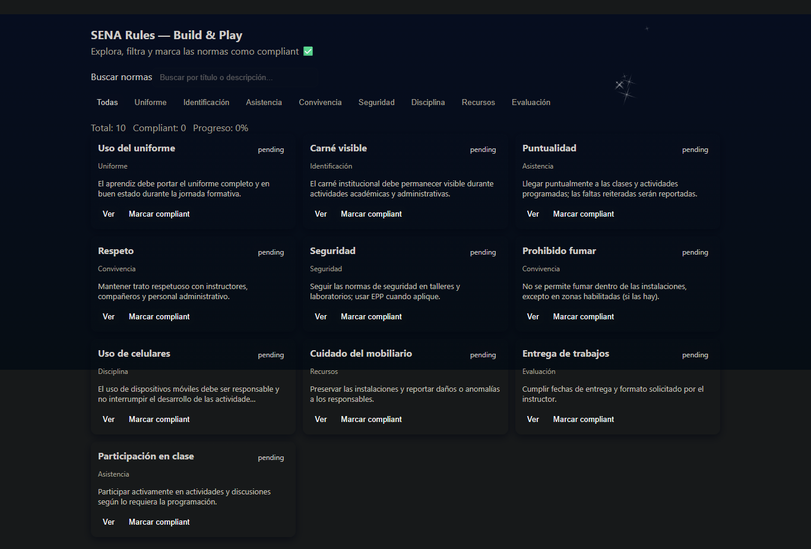
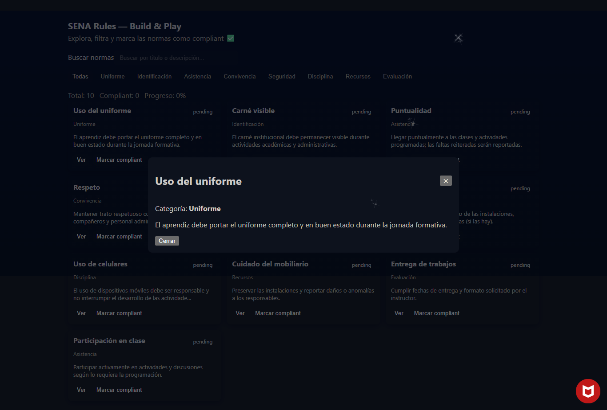

# 🎮 SENA Rules — Build & Play (React + TypeScript)

Aplicación desarrollada como actividad del programa ADSO.
El objetivo es construir una pequeña app interactiva donde el usuario pueda:

- Buscar reglas (Rules)

- Filtrarlas por categoría

- Ver su detalle

- Ver estadísticas en tiempo real

- Interactuar con una interfaz organizada por componentes


## 🚀 1. Propósito de la Aplicación

Esta aplicación permite visualizar un conjunto de “rules” (reglas personalizadas).
El usuario puede:

- Buscar reglas por nombre

- Filtrar reglas por categoría

- Ver el detalle de cada regla

- Ver estadísticas (cantidad total, filtradas, favoritas, etc.)

El proyecto sirve como práctica para:

✔ Componentización
✔ Props y estado
✔ Renderizado condicional
✔ Lifting state up
✔ Manejo de eventos
✔ Hooks (useState, useMemo, useEffect)
✔ Arquitectura modular en React


## 🛠 2. Instalación y Ejecución

### 📌 Requisitos previos

- Node.js 18 o superior

- NPM o Yarn

### 📥 Instalación

npm install

▶ Ejecutar el proyecto en desarrollo
npm run dev


El proyecto iniciará en:

http://localhost:5173

## 🧩 3. Arquitectura del Proyecto
```text
src/
│
├── components/
│ ├── Header.tsx
│ ├── SearchBar.tsx
│ ├── FilterButtons.tsx
│ ├── RuleList.tsx
│ ├── RuleDetail.tsx
│ └── StatsBar.tsx ← componente creado por mí
│
├── data/
│ └── rules.ts
│
├── App.tsx
└── main.tsx
```


2. App.tsx
3. main.tsx

## 📁 Descripción de componentes

| Componente        | Responsabilidad                                                          |
| ----------------- | ------------------------------------------------------------------------ |
| **Header**        | Muestra el título de la app.                                             |
| **SearchBar**     | Permite filtrar reglas por texto (controlado con estado).                |
| **FilterButtons** | Botones para filtrar reglas por categoría.                               |
| **RuleList**      | Lista de reglas renderizadas según búsqueda/filtros.                     |
| **RuleDetail**    | Muestra el detalle de la regla seleccionada.                             |
| **StatsBar** ⭐    | Muestra estadísticas (total, filtradas, etc.). Componentes nuevo creado. |


## ⚛️ 4. Uso de Props, Estado y Eventos
🟦 Props

### Ejemplos:

<RuleList rules={filteredRules} onSelect={setSelectedRule} />


- Paso datos desde App hacia componentes hijos.

- Paso funciones como props para levantar eventos desde componentes hijos.

### 🟩 Estado (useState)
const [rules, setRules] = useState(initialRules)
const [searchTerm, setSearchTerm] = useState("")
const [selectedRule, setSelectedRule] = useState<Rule | null>(null)
const [category, setCategory] = useState("all")


### Usado para:

- Controlar el texto de búsqueda

- Filtrar reglas

- Abrir/cerrar detalle

- Manejar datos dinámicos

## 🟧 Eventos

### Ejemplos:

onChange={(e) => setSearchTerm(e.target.value)}
onClick={() => onSelect(rule)}


### Se usan para:

- Capturar interacciones del usuario

- Actualizar estado

- Filtrar datos

## 🧠 5. Decisiones de Diseño

### ✔ 1 — StatsBar

- Permite mostrar información global (conteo total, filtrado, favoritos…)

- Ayuda al usuario a entender lo que está viendo

- Hace la UI más profesional

### ✔ 2 — RuleDetail

- Evita mezclar demasiada lógica dentro del listado.

- Mantiene un panel dedicado al contenido detallado.

- Mejora la experiencia al mostrar información extendida.

### ✔ 3 — FilterButtons

- Permite una navegación más rápida sin recargar la página.

- Mantiene la responsabilidad separada de SearchBar y RuleList.

- Facilita agregar más filtros en el futuro.

Estas decisiones mantienen una arquitectura limpia, siguiendo la filosofía de componentes pequeños y reutilizables.

## 📸 6. Capturas de Pantalla


### Pantalla Principal


### Detalle


### Funcion


## ✔ 7. Tecnologías utilizadas

- React 18

- TypeScript

- Vite

- Hooks

- CSS / Tailwind (si aplica)
